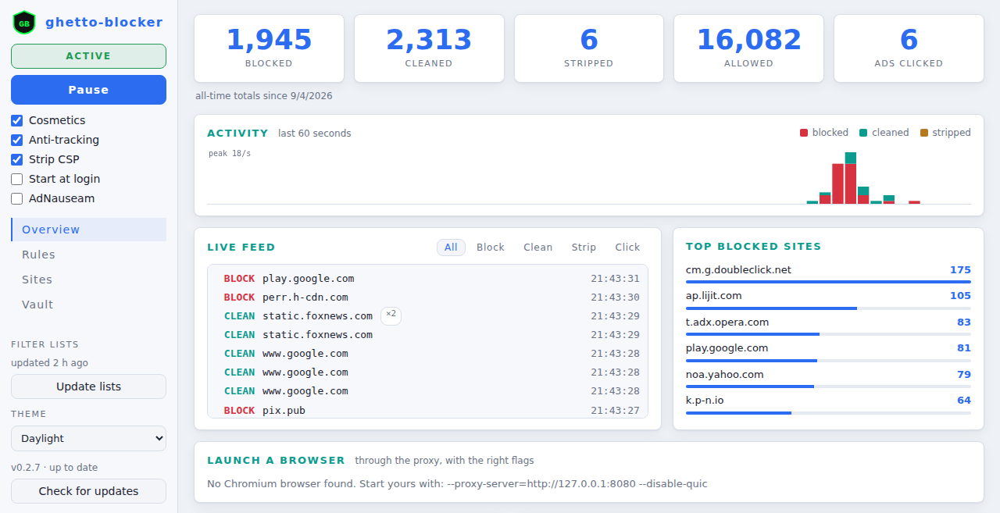
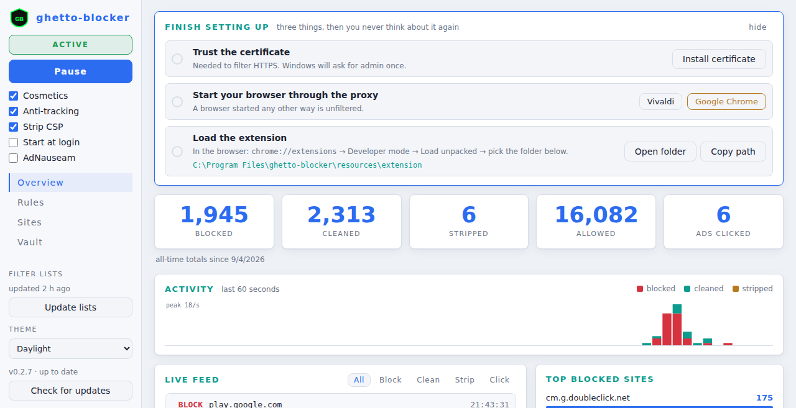
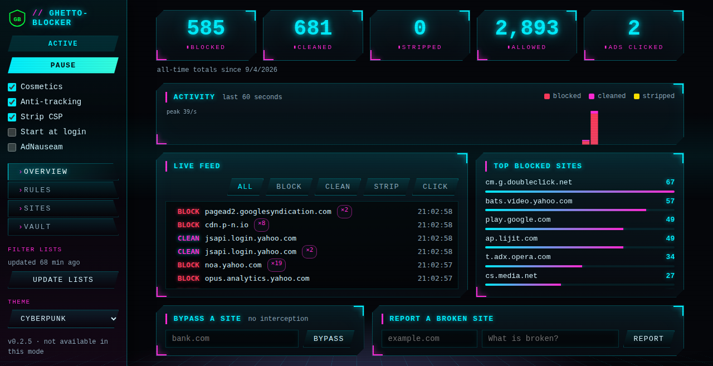
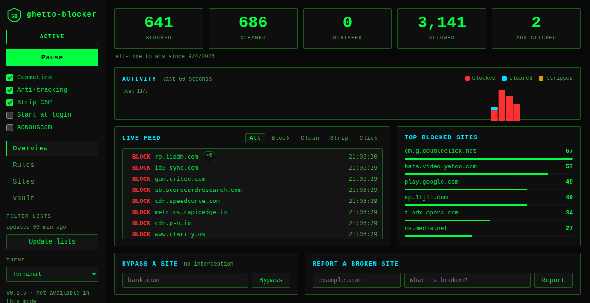
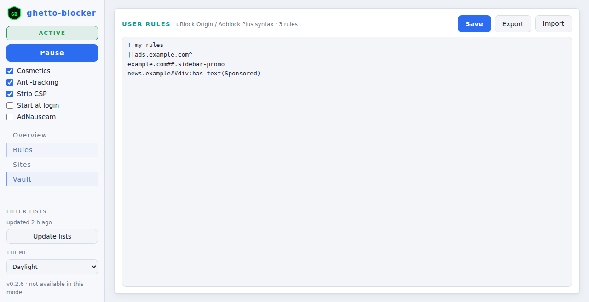
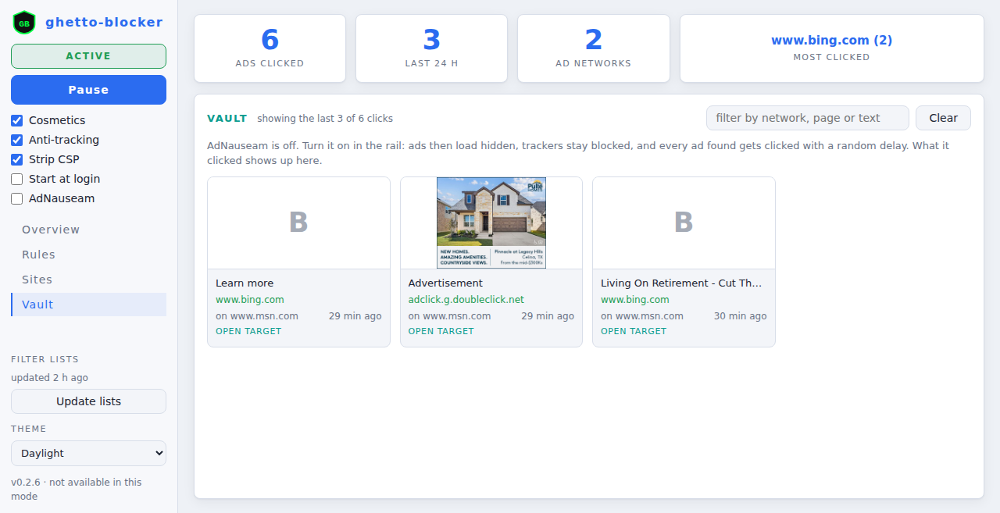

# ghetto-blocker

An ad blocker that lives outside the browser.

Google removed the Manifest V2 APIs that uBlock Origin needed, and the MV3
replacements cap how many rules an extension can enforce. ghetto-blocker
sidesteps the whole thing: it is a small local HTTPS proxy that filters
traffic with the same lists uBlock uses (EasyList, EasyPrivacy, the uBlock
Origin lists) and injects the element-hiding CSS itself. The browser can't
take that away because the browser never sees it.

Works with any Chromium browser (Vivaldi, Chrome, Edge, Brave) on Windows 10
or 11. A companion extension is included; it handles the parts that need to
run inside the page.



## What it does

- Blocks ad and tracker requests before they leave your machine.
- Hides ad containers and placeholders with cosmetic rules. The proxy reads
  each page and picks the rules that apply to what's actually in it, so the
  generic class/id rules from EasyList work, not just per-site ones.
- Runs uBlock's scriptlets (the bits that keep YouTube playable, for example).
- Strips tracking parameters (`utm_*`, `gclid`, `fbclid`, ...) from links.
- With the extension: keeps hiding things that JavaScript adds after the page
  loads, applies procedural rules like `:has-text()`, shows a blocked count
  per tab, and lets you click any element on a page to block it.
- AdNauseam mode, off by default: instead of blocking ads, load them hidden
  and click them in the background so the ad networks' picture of you is
  garbage. Trackers stay blocked. What got clicked is listed in the vault.
- A local dashboard with live activity, per-site controls, custom rules,
  and three themes. Stats persist across restarts.
- Updates itself from GitHub Releases.

## Install

1. Download `ghetto-blocker-Setup-<version>.exe` from
   [Releases](https://github.com/exploitz/ghetto-blocker/releases) and run it.
   Windows SmartScreen will say "Windows protected your PC" because the
   installer isn't code-signed; click **More info → Run anyway**. The installer
   asks for admin rights (it installs to Program Files) and starts the app.
2. The dashboard opens with a three-step checklist. Work through it:

   

   - **Trust the certificate.** One admin prompt. This is what lets the proxy
     see inside HTTPS; read [Security](#security) if you want to know exactly
     what that means.
   - **Start your browser through the proxy.** Click your browser in the
     checklist. If it's already running, quit it first: a running browser
     ignores the flags of a second launch and stays unfiltered.
   - **Load the extension.** In the browser, open `chrome://extensions` (or
     `vivaldi://extensions`), turn on Developer mode, click Load unpacked, and
     pick the folder the checklist shows (there's an Open folder button).

That's it. The app lives in the tray; the dashboard is at
`http://127.0.0.1:8081` or by double-clicking the tray icon.

If you'd rather manage the browser yourself, start it with:

```
chrome.exe --proxy-server="http://127.0.0.1:8080" --disable-quic
```

Don't set the proxy system-wide: non-HTTP apps can't go through an HTTP proxy
and will break. `--disable-quic` matters: Chromium speaks HTTP/3 over UDP when
it can, and a TCP proxy can't intercept that. Loopback addresses bypass the
proxy by default; don't add `<-loopback>` to a bypass list, that flag does the
opposite of what it looks like.

If your browser has its own ad blocker (Vivaldi and Brave do), turn it off.
Two blockers double the work and make it impossible to tell which one did
what.

To check it's working from a terminal:

```
curl -x http://127.0.0.1:8080 --cacert "%USERPROFILE%\.ghetto-blocker\ca\certs\ca.pem" -o NUL -w "%{http_code} %{size_download}" https://www.google-analytics.com/analytics.js
```

A blocked request comes back as `200 0`.

No network on first start? The app starts anyway with empty lists and keeps
retrying the download; the rail says "not downloaded yet" until it succeeds.

## How it works

```
browser --> ghetto-blocker proxy (127.0.0.1:8080) --> internet
                 |
                 |  filter engine (@ghostery/adblocker + uBlock lists)
                 |    request  -> block / redirect / allow
                 |    HTML     -> inject hide-CSS + scriptlets
                 |
             control server (127.0.0.1:8081)
                 |  dashboard, REST API, live event stream
                 |
             extension (MV3) <-- asks the control server which rules
                                 the page's new DOM unlocks; applies them
```

The proxy terminates TLS with certificates it mints on the fly, signed by
the local CA you trusted at install. Chromium accepts user-installed roots
even for sites that would otherwise be pinned, so ordinary browsing works.
Standalone apps that pin their certificates do not; those go on the bypass
list in the dashboard.

Blocked requests get an empty `200` (pages don't error out) with an
`x-ghetto-blocker: block` header the extension counts per tab.

## Dashboard

| | |
|---|---|
| **Rail** | Active/paused, Pause, the toggles (cosmetics, anti-tracking, strip CSP, start at login, AdNauseam), filter-list age with an Update button, theme |
| **Overview** | All-time counters, a 60-second activity graph, the live feed, top blocked sites, quick bypass and broken-site report |
| **Rules** | Your own filter rules in uBlock / Adblock Plus syntax; export and import |
| **Sites** | Allowlist (not filtered) and bypass hosts (not intercepted at all) |
| **Vault** | Everything AdNauseam has clicked |

Themes: Daylight (default), Cyberpunk, Terminal. The window's title bar
follows the theme.

| Cyberpunk | Terminal |
|---|---|
|  |  |



## The extension

The proxy only sees the HTML a server sends. Ad slots created afterwards by
JavaScript are invisible to it, and some uBlock rules (`:has-text()`,
`:upward()`) can't be expressed as CSS at all. The content script watches
the DOM, reports new classes and ids to the control server, and applies
whatever rules those unlock as a user stylesheet that page CSP can't block.

The popup shows the blocked count for the tab, allows or un-allows the
current site, pauses everything, and has the element picker. "Zap" hides
something for the current page only; "Pick" saves a rule.

The extension is MV3 and uses nothing Google is removing. It doesn't block
requests, the proxy does. It asks for access to all sites because it applies
hide rules everywhere; the only thing it talks to is `127.0.0.1:8081`.

## AdNauseam mode

Turn it on in the rail. From then on the proxy lets ad-network requests
through (ads download but stay hidden), keeps enforcing the tracker lists
and your own rules, and the extension looks for the hidden ads' click-through
links. Each one is announced to the control server and fetched in the
background after a random delay, at most eight a minute, with cookies, so it
registers as a click. Pages use more bandwidth in this mode.



## Updates

The app checks GitHub Releases shortly after launch and every six hours,
downloads new versions in the background, and offers "Restart to update" in
the tray and the dashboard. The version line in the rail shows the state.

## Development

Building from source, the headless mode, and how releases are published are
in [docs/DEVELOPMENT.md](docs/DEVELOPMENT.md).

## Security

Read this part.

- **The CA can decrypt your HTTPS.** Anything that trusts it can be
  intercepted by anything holding its private key. The key is generated on
  your machine, stays in `%USERPROFILE%\.ghetto-blocker\ca\`, is never
  shipped or uploaded, and no API route exposes it. Don't copy it around.
  `scripts\uninstall-ca.ps1` removes it from the trust store.
- **Strip CSP** is on by default. Removing a page's Content-Security-Policy
  is what lets the injected CSS and scriptlets run, and it also weakens the
  page's own XSS defences. Turn it off in the dashboard if you'd rather keep
  CSP and lose some cosmetic filtering.
- The control server listens on loopback only and requires an
  `X-GhettoBlocker` header on anything that changes state, so a web page
  can't reconfigure it.
- **Uninstalling removes the CA** from the trust store and deletes its private
  key and the cached filter lists. Settings and your rules are kept.

## Troubleshooting

| | |
|---|---|
| Certificate errors | The CA isn't trusted, or the browser was still running when it was installed. Install, then fully quit and reopen the browser. |
| Counters never move | The browser wasn't started with the proxy flags. Quit it and use "Launch a browser" on the overview. |
| Ads on YouTube / HTTPS sites | QUIC is still on. |
| Ad boxes appear after the page loads | The extension isn't loaded, or its popup dot is red (app not running). |
| A site won't load, or a streaming app (ChatGPT) won't respond | Add its host to Sites -> Bypass hosts. Bypassed hosts are tunneled raw with no interception, so they behave exactly as with no proxy. ChatGPT is bypassed by default. |
| Console shows a React hydration error (#418) | Update to 0.2.8+; the injected styles now go at the end of `<head>` so React apps hydrate cleanly. |
| Pausing doesn't seem to change a page | Reload it; pages already open keep the CSS they were given. If ads still don't show, the browser's own blocker is doing it. |

## License

GPL-3.0. Copyright (c) 2026 exploitz. See [LICENSE](LICENSE).
